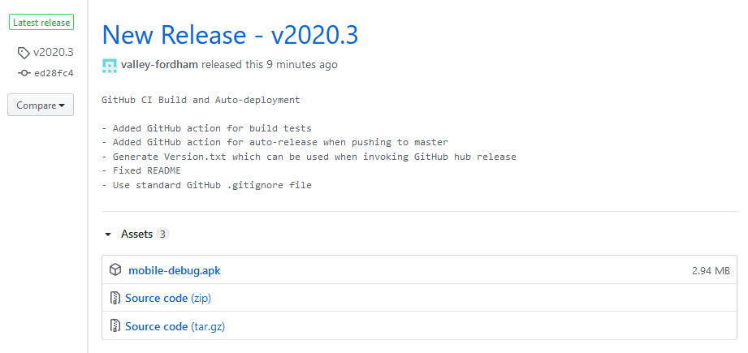

# action-release-debugapk

🕷 Build and release debug APK from your Android project.

This project differs from [ShaunLWM/action-release-debugapk](https://github.com/ShaunLWM/action-release-debugapk) in that it also has a Gradle task prerequisite, which will extract Gradle versionName fields that have function calls.



## Warning ⚠
Add a target branch (eg. master) to build the APK to prevent infinite loop (releasing the APK on the release tag will trigger a rerun of the action).

## Usage

To use the action add the following lines to your `.github/workflows/android.yml` and provide the required Secrets and Environment variables, as well as add the extra task to your module's build.gradle

#### Gradle
Add the following to your module's build.gradle file
```
task generateVersionTxt {
    doLast {
        file("./version.txt").text = android.defaultConfig.versionName
    }
}
```

#### YML
```
name: Build & Publish Debug APK

on:
 push:
  branches:
   - master
   
jobs:
  build:
    runs-on: ubuntu-latest
    steps:
    - uses: actions/checkout@v1
    - name: set up JDK 1.8
      uses: actions/setup-java@v1
      with:
        java-version: 1.8
    - name: Make Gradle executable
      run: chmod +x ./gradlew
    - name: Build with Gradle
      run: ./gradlew build
    - name: Build Debug APK
      run: ./gradlew assembleDebug
    - name: Generate version.txt for Hub release
      run: ./gradlew generateVersionTxt
    - name: Releasing using Hub
      uses: valley-fordham/action-release-debugapk@master
      env:
       GITHUB_TOKEN: ${{ secrets.TOKEN }}
       APP_FOLDER: app
       RELEASE_TITLE: New Build
```

### Secrets

You'll need to provide this secret token to use the action (for publishing the APK). Enter these secrets in your Settings > Secrets

* **TOKEN**: Create a new [access token](https://github.com/settings/tokens) with `repo` access.

I am unsure as to why using the default `GITHUB_TOKEN` provided universally will fail to authorize the user. This is the only workaround that I'd found.

### Environment Variables

You'll need to provide these environment variables to specify exactly what information is needed to build the APK.

* **APP_FOLDER**: main folder to search for the apk. Most of the time, it's `app`
* **RELEASE_TITLE**: title for release

## Credits

Forked from [ShaunLWM/action-release-debugapk](https://github.com/ShaunLWM/action-release-debugapk) which is based on [elgohr/Github-Hub-Action](https://github.com/elgohr/Github-Hub-Action)